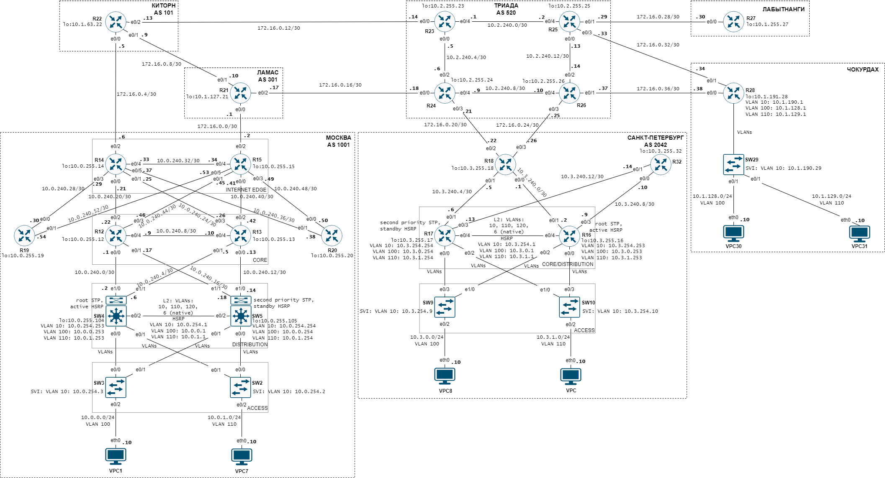

# Топология сети с IPv4 адресацией

# Предложения по корректировке топологии сети
### В регионе Москва:
 1. Свитчи SW4, SW5 поставить L3. И реализовать трехуровневую модель. В таком случае, роутеры R12, R13 будут выполнять функцию ядра, а свитчи SW4, SW5 функцию дистрибуции.
 2. Сделать между свитчами SW4, SW5 один линк. Его хватит, так как не предполагается объединять свитчи в стек. Мне не сильно нравится стекировать оборудование из соображений отказоустойчивости. 
 3. Реализовать взаимодействие между SW4, SW5, SW2, SW3 на втором уровне. С применением разделения на VLAN. В качестве защиты от петель применяется протокол MSTP. Резервирование шлюза реализуется протоколом HSRP. L3 связь между SW4, SW5 не требуется, так как трафик через VLAN попадает на L3 свитч с ролью шлюза, а далее маршрутизируется на уровень дистрибуции.
 4. Подключить роутеры R19 и R20 двумя линками к разным роутерам R14, R15 для обеспечения резервирования.
 5. Организовать линки между роутерами R12, R13 и роутерами R14, R15 в соответствии со схемой топологии трёхуровневой модели. В принципе, данные линки могут быть задействованы для передачи пользовательского трафика только в исключительных случаях при падении более одного линка. На мой взгляд, в остальное время нужны для передачи служебного трафика между роутерами (отслеживание состояния соседа, синхронизация различных служб). Мне кажется, что их можно выполнять на меньшей скорости, например с помощью технологии FastEthernet. 
 6. Назначить VLAN 10 для служебного трафика и управления L2 коммутаторами доступа. Назначить VLAN 100 для пользовательского трафика от VPC1. Назначить VLAN 110 для пользовательского трафика от VPC7.
### В регионе Санкт-Петербург:
 1. Предлагаю данный регион рассматривать относительно двухуровневой модели, тогда роутеры R16, R17 будут совмещать функции ядра и дистрибуции. В таком случае коммутаторы SW9, SW10 будут работать на уровне L2.
 2. Реализовать взаимодействие между R16, R17, SW9, SW10 на втором уровне. С применением разделения на VLAN. В качестве защиты от петель применяется протокол MSTP. Резервирование шлюза реализуется протоколом HSRP. Передача служебного трафика между R17, R18 возможна через служебный VLAN 10.
 3. Добавить линк между R17 и R18. На уровне L2 применить технологию VLAN. Данный линк требуется для передачи пользовательского трафика при потере линков SW9-R16 и SW10-R17, если один VLAN находится сразу на двух коммутаторах.
 4. Убрать два линка между коммутаторами доступа SW9, SW10. Так как не планируется объединять коммутаторы в стек, а пересылку горизонтального пользовательского трафика осуществлять через уровень ядра/дистрибуции.
 5. Подключить роутер R32 двумя линками к разным роутерам R16, R17 для обеспечения резервирования.
 6. Назначить VLAN 10 для служебного трафика и управления L2 коммутаторами доступа. Назначить VLAN 100 для пользовательского трафика от VPC8. Назначить VLAN 110 для пользовательского трафика от VPC.
### В регионе Чокурдах:
 1. Назначить VLAN 10 для служебного трафика и управления L2 коммутаторами доступа. Назначить VLAN 100 для пользовательского трафика от VPC30. Назначить VLAN 110 для пользовательского трафика от VPC31.
# План адресации IPv4
```diff
10.0.0.0/16 - Moscow AS1001
	10.0.0.0/17 - Clients
		10.0.0.0/24 - VLAN 100 (VPC1)
			10.0.0.1 - Gateway / HSRP
#			10.0.0.2-10.0.0.9 - Vacant
			10.0.0.10 - VPC1
#			10.0.0.11-10.0.0.252 - Vacant
			10.0.0.253 - SW4 e0/0.100
			10.0.0.254 - SW5 e0/0.100
		10.0.1.0/24 - VLAN 110 (VPC7)
			10.0.1.1 - Gateway / HSRP
#			10.0.1.2-10.0.1.9 - Vacant
			10.0.1.10 - VPC7
#			10.0.1.11-10.0.1.252 - Vacant
			10.0.1.253 - SW4 e0/0.110
			10.0.1.254 - SW5 e0/0.110
#		10.0.2.0-10.0.127.255 - Vacant
#	10.0.128.0-10.0.239.255 - Vacant
	10.0.240.0/20 - Network needs
		10.0.240.0/21 - PtP links between routers
			10.0.240.0/30 - R12 - SW4
			10.0.240.4/30 - R13 - SW4
			10.0.240.8/30 - R12 - R13
			10.0.240.12/30 - R13 - SW5
			10.0.240.16/30 - R12 - SW5
			10.0.240.20/30 - R14 - R12
			10.0.240.24/30 - R14 - R13
			10.0.240.28/30 - R14 - R19
			10.0.240.32/30 - R14 - R15
			10.0.240.36/30 - R14 - R20
			10.0.240.40/30 - R15 - R13
			10.0.240.44/30 - R15 - R12
			10.0.240.48/30 - R15 - R20
			10.0.240.52/30 - R15 - R19
#			10.0.240.56-10.0.247.255 - Vacant
#		10.0.248.0-10.0.253.255 - Vacant
		10.0.254.0/24 - MGMT VLAN
			10.0.254.1 - Gateway / HSRP
			10.0.254.2 - SW2 SVI
			10.0.254.3 - SW3 SVI
#			10.0.254.4-10.0.254.252 - Vacant
			10.0.254.253 - SW4 e0/0.10
			10.0.254.254 - SW5 e0/0.10
		10.0.255.0/24 - Loopback interfaces
#			10.0.255.0-10.0.255.11 - Vacant
			10.0.255.12/32 - R12 lo
			10.0.255.13/32 - R13 lo
			10.0.255.14/32 - R14 lo
			10.0.255.15/32 - R15 lo
			10.0.255.19/32 - R19 lo
			10.0.255.20/32 - R20 lo
#			10.0.255.21-10.0.255.103 - Vacant
			10.0.255.104/32 - SW4 lo
			10.0.255.105/32 - SW5 lo
#			10.0.255.106-10.0.255.255 - Vacant
10.1.0.0/18 - Kitorn AS101
#	10.1.0.0-10.1.61.255 - Vacant
	10.1.56.0/21 - Network needs
#		10.1.56.0-10.1.62.255-Vacant
		10.1.63.0/24 - Loopback interfaces
#			10.1.63.0-10.1.63.21 - Vacant
			10.1.63.22/32 - R22 lo
#			10.1.63.23-10.1.63.255 - Vacant
10.1.64.0/18 - Lamas AS301
#	10.1.64.0-10.1.125.255 - Vacant
	10.1.120.0/21 - Network needs
#		10.1.120.0-10.1.126.255 - Vacant
		10.1.127.0/24 - Loopback interfaces
#			10.1.127.0-10.1.127.20 - Vacant
			10.1.127.21/32 - R21 lo
#			10.1.127.22-10.1.127.255 - Vacant
10.1.128.0/18 - Chokurdah
	10.1.128.0/19 - Clients
		10.1.128.0/24 - VLAN 100 (VPC30)
			10.1.128.1 - Gateway
#			10.1.128.2-10.1.128.9 - Vacant
			10.1.128.10 - VPC30
#			10.1.128.11-10.1.128.254 - Vacant
		10.1.129.0/24 - VLAN 110 (VPC31)
			10.1.129.1 - Gateway
#			10.1.129.2-10.1.129.9 - Vacant
			10.1.129.10 - VPC31
#			10.1.129.11-10.1.129.254 - Vacant
#		10.1.130.0-10.1.159.255 - Vacant
#	10.1.160.0-10.1.189.255 - Vacant
	10.1.184.0/21 - Network needs
#		10.1.184.0-10.1.189.255 - Vacant
		10.1.190.0/24 MGMT VLAN
			10.1.190.1 - Gateway
#			10.1.190.2-10.1.190.28 - Vacant
			10.1.190.29 - SW29 SVI
#			10.1.190.30-10.1.190.254 - Vacant
		10.1.191.0/24 - Loopback interfaces
#			10.1.127.0-10.1.127.20 - Vacant
			10.1.127.21/32 - R28 lo
#			10.1.127.22-10.1.127.255 - Vacant
10.1.192.0/18 - Labitnangi
#	10.1.192.0-10.1.253.255 - Vacant
	10.1.248.0/21 - Network needs
#		10.1.248.0-10.1.254.255 - Vacant
		10.1.255.0/24 - Loopback interfaces
#			10.1.255.0-10.1.255.26 - Vacant
			10.1.127.27/32 - R27 lo
#			10.1.255.28-10.1.255.255 - Vacant
10.2.0.0/16 - Triada AS520
#	10.2.0.0-10.2.239.255 - Vacant
	10.2.240.0/20 - Network needs
		10.2.240.0/21 - PtP links between routers
			10.2.240.0/30 - R23 - R25
			10.2.240.4/30 - R23 - R24
			10.2.240.8/30 - R24 - R26
			10.2.240.12/30 - R25 - R26
#			10.2.240.16-10.2.247.255 - Vacant
#		10.0.248.0-10.0.255.255 - Vacant
		10.0.255.0/24 - Loopback interfaces
#			10.2.255.0-10.2.255.22 - Vacant
			10.2.255.23/32 - R23 lo
			10.2.255.24/32 - R24 lo
			10.2.255.25/32 - R25 lo
			10.2.255.26/32 - R26 lo
#			10.2.255.27-10.2.255.255 - Vacant
10.3.0.0/16 - St.-Petersburg AS2042
	10.3.0.0/17 - Clients
		10.3.0.0/24 - VLAN 100 (VPC8)
			10.3.0.1 - Gateway / HSRP
#			10.3.0.2-10.3.0.9 - Vacant
			10.3.0.10 - VPC8
#			10.3.0.11-10.3.0.252 - Vacant
			10.3.0.253 - R16 e0/0.100
			10.3.0.254 - R17 e0/0.100
		10.3.1.0/24 - VLAN 110 (VPC)
			10.3.1.1 - Gateway / HSRP
#			10.3.1.2-10.3.1.9 - Vacant
			10.3.1.10 - VPC
#			10.3.1.11-10.3.1.252 - Vacant
			10.3.1.253 - R16 e0/0.110
			10.3.1.254 - R17 e0/0.110
#		10.3.2.0-10.3.127.255 - Vacant
#	10.3.128.0-10.3.239.255 - Vacant
	10.3.240.0/20 - Network needs
		10.3.240.0/21 - PtP links between routers
			10.3.240.0/30 - R18 - R18
			10.3.240.4/30 - R18 - R17
			10.3.240.8/30 - R16 - R32
			10.3.240.12/32 - R17 - R32
#			10.3.240.16-10.3.247.255 - Vacant
#		10.3.248.0-10.3.253.255 - Vacant
		10.3.254.0/24 - MGMT VLAN
			10.3.254.1 - Gateway / HSRP
#			10.3.254.2-10.3.254.8 - Vacant
			10.3.254.9 - SW9 SVI
			10.3.254.10 - SW10 SVI
#			10.3.254.11-10.3.254.252 - Vacant
			10.3.254.253 - R16 e0/0.10
			10.3.254.254 - R17 e0/0.10
		10.3.255.0/24 - Loopback interfaces
#			10.3.255.0-10.3.255.15 - Vacant
			10.3.255.16/32 - R16 lo
			10.3.255.17/32 - R17 lo
			10.3.255.18/32 - R18 lo
#			10.3.255.19-10.3.255.31 - Vacant
			10.3.255.32/32 - R32 lo
#			10.3.255.33-10.3.255.255 – Vacant
# 10.4.0.0-10.255.255.255 - Vacant
172.16.0.0/16 - PtP links between locations
	172.16.0.0/30 - Lamas R21 - Moscow R15
	172.16.0.4/30 - Kitorn R22 - Moscow R14
	172.16.0.8/30 - Lamas R21 - Kitorn R22
	172.16.0.12/30 - Kitorn R22 - Triada R23
	172.16.0.16/30 - Lamas R21 - Triada R24
	172.16.0.20/30 - Triada R24 - St.-Petersburg R18
	172.16.0.24/30 - Triada R26 - St.-Petersburg R18
	172.16.0.28/30 - Triada R25 - Labitnangi R27
	172.16.0.32/30 - Triada R25 - Chokurdah R28
	172.16.0.36/30 - Triada R26 - Chokurdah R28
#	172.16.0.40-172.16.255.255 - Vacant
# 172.17.0.0-172.31.255.255 - Vacant
# 192.168.0.0-192.168.255.255 - Vacant
```
# План адресации IPv6
```diff
2ccc:0:3e9::/48 - Moscow AS1001
	2ccc:0:3e9::/49 - Clients
		2ccc:0:3e9::/64 - VLAN 100 (VPC1)
			2ccc:0:3e9::1 - Gateway / HSRP
			2ccc:0:3e9::a - VPC1
			2ccc:0:3e9:0:ffff::1 - SW4 e0/0.100
			2ccc:0:3e9:0:ffff::2 - SW5 e0/0.100
		2ccc:0:3e9:1::/64 - VLAN 110 (VPC7)
			2ccc:0:3e9:1::1 - Gateway / HSRP
			2ccc:0:3e9:1::a - VPC7
			2ccc:0:3e9:1:ffff::1 - SW4 e0/0.110
			2ccc:0:3e9:1:ffff::2 - SW5 e0/0.110
	2ccc:0:3e9:fff0::/60 - Network needs
		2ccc:0:3e9:fffd::/64 - PtP links between routers
			2ccc:0:3e9:fffe::/126 - R12 - SW4
			2ccc:0:3e9:fffe::1:0/126 - R13 - SW4
			2ccc:0:3e9:fffe::2:0/126 - R12 - R13
			2ccc:0:3e9:fffe::3:0/126 - R13 - SW5
			2ccc:0:3e9:fffe::4:0/126 - R12 - SW5
			2ccc:0:3e9:fffe::5:0/126 - R14 - R12
			2ccc:0:3e9:fffe::6:0/126 - R14 - R13
			2ccc:0:3e9:fffe::7:0/126 - R14 - R19
			2ccc:0:3e9:fffe::8:0/126 - R14 - R15
			2ccc:0:3e9:fffe::9:0/126 - R14 - R20
			2ccc:0:3e9:fffe::a:0/126 - R15 - R13
			2ccc:0:3e9:fffe::b:0/126 - R15 - R12
			2ccc:0:3e9:fffe::c:0/126 - R15 - R20
			2ccc:0:3e9:fffe::d:0/126 - R15 - R19
		2ccc:0:3e9:fffe::/64 - MGMT VLAN
			2ccc:0:3e9:fffe::1 - Gateway / HSRP
			2ccc:0:3e9:fffe::2 - SW2 SVI
			2ccc:0:3e9:fffe::3 - SW3 SVI
			2ccc:0:3e9:fffe:ffff::1 - SW4 e0/0.10
			2ccc:0:3e9:fffe:ffff::2 - SW5 e0/0.10
		2ccc:0:3e9:ffff::/64 - Loopback interfaces
			2ccc:0:3e9:ffff::12/128 - R12 lo
			2ccc:0:3e9:ffff::13/128 - R13 lo
			2ccc:0:3e9:ffff::14/128 - R14 lo
			2ccc:0:3e9:ffff::15/128 - R15 lo
			2ccc:0:3e9:ffff::19/128 - R19 lo
			2ccc:0:3e9:ffff::20/128 - R20 lo
			2ccc:0:3e9:ffff::104/128 - SW4 lo
			2ccc:0:3e9:ffff::105/128 - SW5 lo

2ccc:0:65::/48 - Kitorn AS101
	2ccc:0:65:fff0::/60 - Network needs
		2ccc:0:65:ffff::/64 - Loopback interfaces
			2ccc:0:65:ffff::22/128 - R22 lo
2ccc:0:12d::/48 - Lamas AS301
	2ccc:0:12d:fff0::/60 - Network needs
		10.1.127.0/24 - Loopback interfaces
			10.1.127.21/32 - R21 lo
10.1.128.0/18 - Chokurdah
	10.1.128.0/19 - Clients
		10.1.128.0/24 - VLAN 100 (VPC30)
			10.1.128.1 - Gateway
#			10.1.128.2-10.1.128.9 - Vacant
			10.1.128.10 - VPC30
#			10.1.128.11-10.1.128.254 - Vacant
		10.1.129.0/24 - VLAN 110 (VPC31)
			10.1.129.1 - Gateway
#			10.1.129.2-10.1.129.9 - Vacant
			10.1.129.10 - VPC31
#			10.1.129.11-10.1.129.254 - Vacant
#		10.1.130.0-10.1.159.255 - Vacant
#	10.1.160.0-10.1.189.255 - Vacant
	10.1.184.0/21 - Network needs
#		10.1.184.0-10.1.189.255 - Vacant
		10.1.190.0/24 MGMT VLAN
			10.1.190.1 - Gateway
#			10.1.190.2-10.1.190.28 - Vacant
			10.1.190.29 - SW29 SVI
#			10.1.190.30-10.1.190.254 - Vacant
		10.1.191.0/24 - Loopback interfaces
#			10.1.127.0-10.1.127.20 - Vacant
			10.1.127.21/32 - R28 lo
#			10.1.127.22-10.1.127.255 - Vacant
10.1.192.0/18 - Labitnangi
#	10.1.192.0-10.1.253.255 - Vacant
	10.1.248.0/21 - Network needs
#		10.1.248.0-10.1.254.255 - Vacant
		10.1.255.0/24 - Loopback interfaces
#			10.1.255.0-10.1.255.26 - Vacant
			10.1.127.27/32 - R27 lo
#			10.1.255.28-10.1.255.255 - Vacant
10.2.0.0/16 - Triada AS520
#	10.2.0.0-10.2.239.255 - Vacant
	10.2.240.0/20 - Network needs
		10.2.240.0/21 - PtP links between routers
			10.2.240.0/30 - R23 - R25
			10.2.240.4/30 - R23 - R24
			10.2.240.8/30 - R24 - R26
			10.2.240.12/30 - R25 - R26
#			10.2.240.16-10.2.247.255 - Vacant
#		10.0.248.0-10.0.255.255 - Vacant
		10.0.255.0/24 - Loopback interfaces
#			10.2.255.0-10.2.255.22 - Vacant
			10.2.255.23/32 - R23 lo
			10.2.255.24/32 - R24 lo
			10.2.255.25/32 - R25 lo
			10.2.255.26/32 - R26 lo
#			10.2.255.27-10.2.255.255 - Vacant
10.3.0.0/16 - St.-Petersburg AS2042
	10.3.0.0/17 - Clients
		10.3.0.0/24 - VLAN 100 (VPC8)
			10.3.0.1 - Gateway / HSRP
#			10.3.0.2-10.3.0.9 - Vacant
			10.3.0.10 - VPC8
#			10.3.0.11-10.3.0.252 - Vacant
			10.3.0.253 - R16 e0/0.100
			10.3.0.254 - R17 e0/0.100
		10.3.1.0/24 - VLAN 110 (VPC)
			10.3.1.1 - Gateway / HSRP
#			10.3.1.2-10.3.1.9 - Vacant
			10.3.1.10 - VPC
#			10.3.1.11-10.3.1.252 - Vacant
			10.3.1.253 - R16 e0/0.110
			10.3.1.254 - R17 e0/0.110
#		10.3.2.0-10.3.127.255 - Vacant
#	10.3.128.0-10.3.239.255 - Vacant
	10.3.240.0/20 - Network needs
		10.3.240.0/21 - PtP links between routers
			10.3.240.0/30 - R18 - R18
			10.3.240.4/30 - R18 - R17
			10.3.240.8/30 - R16 - R32
			10.3.240.12/32 - R17 - R32
#			10.3.240.16-10.3.247.255 - Vacant
#		10.3.248.0-10.3.253.255 - Vacant
		10.3.254.0/24 - MGMT VLAN
			10.3.254.1 - Gateway / HSRP
#			10.3.254.2-10.3.254.8 - Vacant
			10.3.254.9 - SW9 SVI
			10.3.254.10 - SW10 SVI
#			10.3.254.11-10.3.254.252 - Vacant
			10.3.254.253 - R16 e0/0.10
			10.3.254.254 - R17 e0/0.10
		10.3.255.0/24 - Loopback interfaces
#			10.3.255.0-10.3.255.15 - Vacant
			10.3.255.16/32 - R16 lo
			10.3.255.17/32 - R17 lo
			10.3.255.18/32 - R18 lo
#			10.3.255.19-10.3.255.31 - Vacant
			10.3.255.32/32 - R32 lo
#			10.3.255.33-10.3.255.255 – Vacant
# 10.4.0.0-10.255.255.255 - Vacant
172.16.0.0/16 - PtP links between locations
	172.16.0.0/30 - Lamas R21 - Moscow R15
	172.16.0.4/30 - Kitorn R22 - Moscow R14
	172.16.0.8/30 - Lamas R21 - Kitorn R22
	172.16.0.12/30 - Kitorn R22 - Triada R23
	172.16.0.16/30 - Lamas R21 - Triada R24
	172.16.0.20/30 - Triada R24 - St.-Petersburg R18
	172.16.0.24/30 - Triada R26 - St.-Petersburg R18
	172.16.0.28/30 - Triada R25 - Labitnangi R27
	172.16.0.32/30 - Triada R25 - Chokurdah R28
	172.16.0.36/30 - Triada R26 - Chokurdah R28
#	172.16.0.40-172.16.255.255 - Vacant
# 172.17.0.0-172.31.255.255 - Vacant
# 192.168.0.0-192.168.255.255 - Vacant

